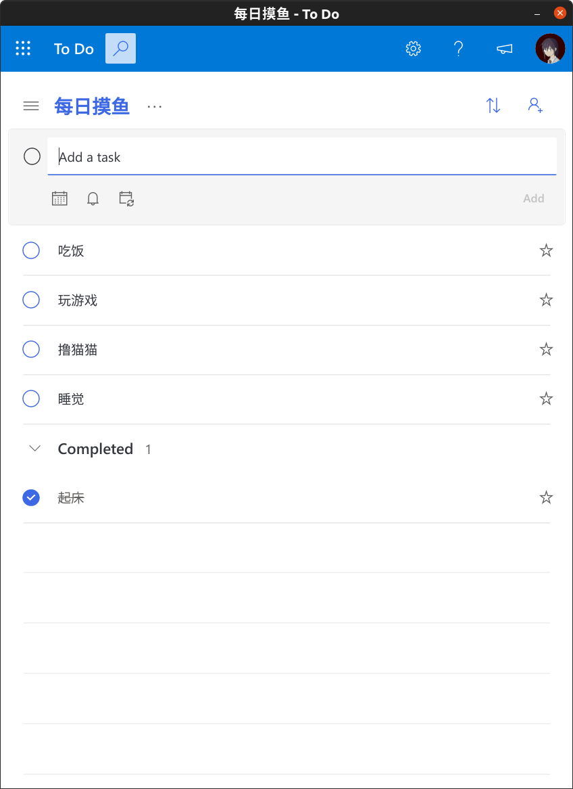

# Microsoft-ToDo-Electron

Microsoft To Do Client in Electron

由于Linux端没有令我满意的ToDo应用，故使用Electron包装了这个Microsoft To Do客户端，以提供一致的备忘体验。

<div align=center></div>

## 构建

```text
$ git clone https://github.com/Thaumy/Microsoft-ToDo-Electron.git
$ cd Microsoft-ToDo-Electron && npm install
$ yarn dist
```

默认编译目标为tar.gz，如果你需要其他类型的安装包，请修改package.json的build.linux.target节点,
有关信息[参见](https://www.electron.build/configuration/configuration#configuration)。

## 使用

1. 解压tar.gz包到你想要的安装位置
2. 运行 microsoft-todo-electron
3. 登录账号密码（如果你的设备可信，建议勾选记住用户）
4. enjoy!

第一次启动可能会比较慢，这是因为应用需要建立缓存。

如需更换账户信息，请执行以下命令（注意将`YOUR_USER_NAME`替换为你的用户名）

`rm -rf /home/YOUR_USER_NAME/.config/microsoft-todo-electron`

之后从步骤2继续即可。
